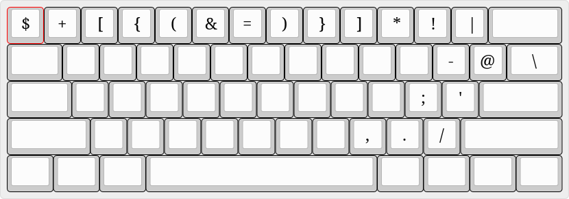
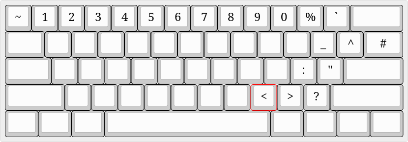
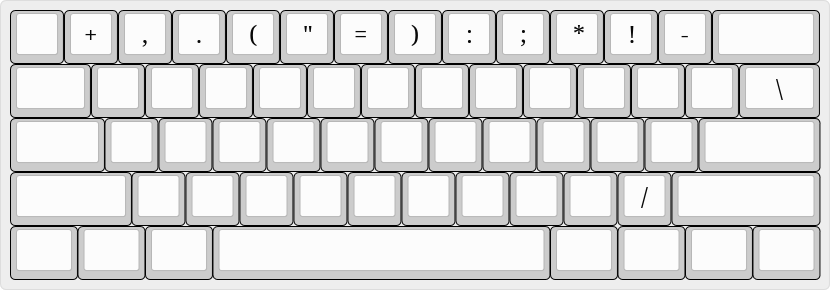
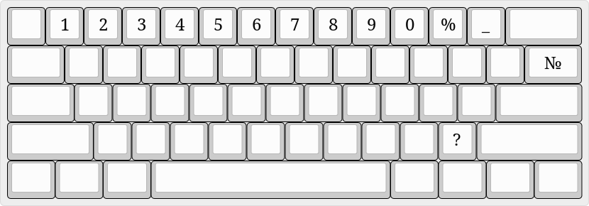

collection of different linux configurations which I stole over the internet and adjusted for personal usage

neovim configured with help of ThePrimeAgen guide videos

I don't want to create smart system to handle different themes, so I'm just saving their names here to not forget 

grub: polydark on pc and standby with custom bg on laptop

alacritty: carbonfox on pc and gruvbox on laptop

ranger: jungle

jetbrains: my_gruvbox with custom colorscheme

keyboard configs should be placed in /usr/share/X11/xkb/symbols
# Keyboards
- English basic

- English shift

- Russian basic

- Russian shift

